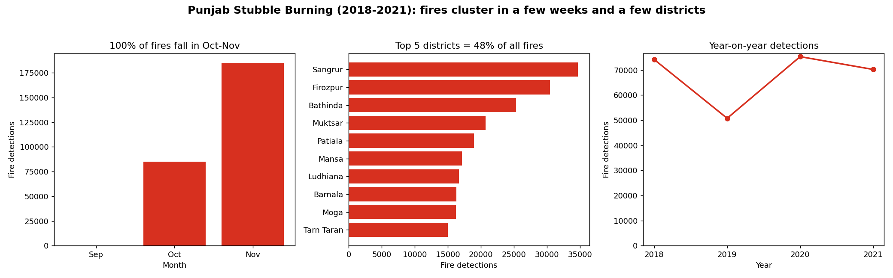

# Data Story — Punjab Stubble Burning

## Headline
**270,407 satellite-detected farm fires (2018–2021). 99.9% burned in just October–November. Five districts — Sangrur, Firozpur, Bathinda, Muktsar, Patiala — account for nearly half of them.**

## 150-word story (for a District officer / grassroots leader)

> **Sir/Madam,** every autumn our fields disappear under smoke — and the satellites
> prove it is not random. Of 2.7 lakh farm fires recorded across Punjab between
> 2018 and 2021, **99.9% were lit in a single six-week window: mid-October to
> late November**, right after the paddy harvest. Worse, they are not spread
> evenly: **just five districts — Sangrur, Firozpur, Bathinda, Muktsar and
> Patiala — produce almost half of all fires in the state.**
>
> This is good news for action. We do not need a year-round, statewide campaign.
> We need **boots on the ground in five districts for six weeks.** Pre-position
> Happy Seeder and baler machines in these blocks before October 15, run village
> awareness drives in September, and concentrate enforcement and incentive
> payouts where the data points. Targeted effort here clears the air for the
> whole region. **The smoke has an address — let us go to it.**

*(Word count of the story above: ~150.)*

## Why this matters
Stubble burning is the largest seasonal driver of Delhi-NCR and Punjab air
pollution. Because the problem is concentrated in **time** (Oct–Nov) and
**space** (5 districts), interventions — machinery subsidies, awareness drives,
enforcement — can be surgically targeted instead of spread thin statewide.

---

## Dataset segment used
- **Source:** `climate_data` — Punjab satellite stubble-burning detections.
- **Segment:** the full attached file, **270,442 raw rows**, years **2018–2021**,
  all 26 districts. After cleaning, **270,407 rows** were analysed.
- Sensors: VIIRS (S-NPP) plus MODIS (AQUA / TERRA) and a few NOAA/METOP passes.

## Note on the brief
The challenge template references "water governance," but the supplied dataset is
**agricultural-fire / air-quality** data. The analysis is reframed to that domain
(stubble-burning governance) — same structure: cleaning → insight → story.

## AI-tool / prompt note
Generative AI (Claude) was used to scaffold the modular pipeline and draft this
story. Representative prompts:
- *"Profile this CSV: dtypes, null counts, value ranges; flag anomalies in dates,
  district casing, and coordinates."*
- *"Latitude max is 76 — confirm whether lat/long are swapped or latitude is
  overwritten, and whether it's recoverable from the latlong text column."*
- *"Write a clean, modular Python pipeline (config / cleaning / analysis /
  visualize) — no unused code — that quantifies time and district concentration."*
- *"Draft a 150-word data story for a district official to spark action."*

All numbers were computed by the code in this repo (`python main.py`), not by the
model.
